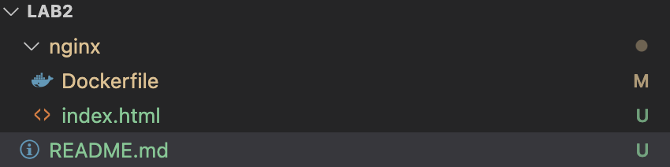

1) Скачал Docker Desktop
2) Создал nginx image
3) Создал проект в vs code

4) Docker file и index.html

5) Забилдил контейнер через комманду в терминале:
docker build --no-cache -t nginx:latest .
6) Запустил контейнер через комманду в терминале:
docker run -d -p 8080:80 --name lab2-nginx-container nginx:latest
